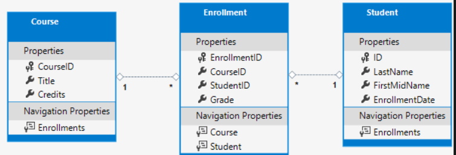

# But du workshop
- Pratiquer la mise en place d'un projet MVC en utilisant l'ORM Entity Framework
- Ce workshop est dérivé du tutoriel guidé de Microsoft
- J'ai adapté les étapes à ce que l'on a appris ensemble

## Créer votre projet
- Créer une solution, nommez la comme vous voulez
- Dans cette solution, créez un projet ASP.Net MVC (Application web ASP.NET (modèle-vue-contrôleur)), je l'ai nommé "ContosoUniversity"
    - Ne mettez pas d'authentification
    - Ne cochez pas la prise en charge de conteneur (Docker)
- Ajoutez les dépendances suivantes avec NuGet (pour Entity) : 
    - Microsoft.EntityFrameworkCore
    - Microsoft.EntityFrameworkCore.Tools
    - Microsoft.EntityFrameworkCore.Design
    - Microsoft.EntityFrameworkCore.SqlServer
- Ouvrez le terminal (Ctrl+ù) puis installez les outils dotnet-ef (possible que ça marche plus, mais du coup c'est ptetre pas nécessaire): 
    - dotnet tool install --global dotnet-ef
- Regénérer le projet pour vérifier que tout va bien

## Adapter le contenu créé automatiquement
- Modifiez le fichier _Layout.cshtml (dans le dossier /Views/Shared) avec le contenu suivant :
```html
<!DOCTYPE html>
<html lang="en">
<head>
    <meta charset="utf-8" />
    <meta name="viewport" content="width=device-width, initial-scale=1.0" />
    <title>@ViewData["Title"] - Contoso University</title>
    <link rel="stylesheet" href="~/lib/bootstrap/dist/css/bootstrap.css" />
    <link rel="stylesheet" href="~/css/site.css" />
</head>
<body>
    <header>
        <nav class="navbar navbar-expand-sm navbar-toggleable-sm navbar-light bg-white border-bottom box-shadow mb-3">
            <div class="container">
                <a class="navbar-brand" asp-area="" asp-controller="Home" asp-action="Index">Contoso University</a>
                <button class="navbar-toggler" type="button" data-toggle="collapse" data-target=".navbar-collapse" aria-controls="navbarSupportedContent"
                        aria-expanded="false" aria-label="Toggle navigation">
                    <span class="navbar-toggler-icon"></span>
                </button>
                <div class="navbar-collapse collapse d-sm-inline-flex justify-content-between">
                    <ul class="navbar-nav flex-grow-1">
                        <li class="nav-item">
                            <a class="nav-link text-dark" asp-area="" asp-controller="Home" asp-action="Index">Home</a>
                        </li>
                        <li class="nav-item">
                            <a class="nav-link text-dark" asp-area="" asp-controller="Home" asp-action="Privacy">Privacy</a>
                        </li>
                        <li class="nav-item">
                            <a class="nav-link text-dark" asp-area="" asp-controller="Students" asp-action="Index">Students</a>
                        </li>
                        <li class="nav-item">
                            <a class="nav-link text-dark" asp-area="" asp-controller="Courses" asp-action="Index">Courses</a>
                        </li>
                        <li class="nav-item">
                            <a class="nav-link text-dark" asp-area="" asp-controller="Enrollments" asp-action="Index">Enrollments</a>
                        </li>
                    </ul>
                </div>
            </div>
        </nav>
    </header>
    <div class="container">
        <main role="main" class="pb-3">
            @RenderBody()
        </main>
    </div>

    <footer class="border-top footer text-muted">
        <div class="container">
            &copy; 2020 - Contoso University - <a asp-area="" asp-controller="Home" asp-action="Privacy">Privacy</a>
        </div>
    </footer>
    <script src="~/lib/jquery/dist/jquery.js"></script>
    <script src="~/lib/bootstrap/dist/js/bootstrap.bundle.js"></script>
    <script src="~/js/site.js" asp-append-version="true"></script>
    @await RenderSectionAsync("Scripts", required: false)
</body>
</html>
```
- Faites de même avec le fichier Index.cshtml (dans le dossier /Views/Home) :
```html
@{
    ViewData["Title"] = "Home Page";
}

<div class="jumbotron">
    <h1>Contoso University</h1>
</div>
<div class="row">
    <div class="col-md-4">
        <h2>Welcome to Contoso University</h2>
        <p>
            Contoso University is a sample application that
            demonstrates how to use Entity Framework Core in an
            ASP.NET Core MVC web application.
        </p>
    </div>
    <div class="col-md-4">
        <h2>Build it from scratch</h2>
        <p>You can build the application by following the steps in a series of tutorials.</p>
        <p><a class="btn btn-default" href="https://docs.asp.net/en/latest/data/ef-mvc/intro.html">See the tutorial &raquo;</a></p>
    </div>
    <div class="col-md-4">
        <h2>Download it</h2>
        <p>You can download the completed project from GitHub.</p>
        <p><a class="btn btn-default" href="https://github.com/dotnet/AspNetCore.Docs/tree/main/aspnetcore/data/ef-mvc/intro/samples/5cu-final">See project source code &raquo;</a></p>
    </div>
</div>
```
- A ce stade, votre projet doit pouvoir se lancer et votre interface devrait être adaptée (attention, les pages Students / Courses etc... ne fonctionnent pas encore)

## Créer les models dont nous aurons besoin
- Voici un schéma des models que nous allons créer : 
- Dans le dossier Models, créer les trois classes suivantes :
- Student :
```cs
public class Student
{
    public int StudentId { get; set; }
    public string LastName { get; set; }
    public string FirstMidName { get; set; }

    public virtual ICollection<Enrollment> Enrollments { get; set; }
}
```
- Enrollment (l'énumération peut être créée dans un fichier séparé si vous préférez):
```cs
public enum Grade
{
    A, B, C, D, F
}

public class Enrollment
{
    public int EnrollmentId { get; set; }
    public int CourseId { get; set; }
    public int StudentId { get; set; }
    public Grade? Grade { get; set; }

    public virtual Course Course { get; set; }
    public virtual Student Student { get; set; }
}
```
- Course :
```cs
public class Course
{
    public int CourseId { get; set; }
    public string Title { get; set; }
    public int Credits { get; set; }

    public virtual ICollection<Enrollment> Enrollments { get; set; }
}
```

## Création du DatabaseContext (pour notre ORM) et injection de dépendance
- Créer un nouveau dossier "Database" à la racine du projet
- Créer à l'intérieur de ce dossier une classe SchoolContext **Pensez à modifier votre chaîne de connexion !**
```cs
public class SchoolContext : DbContext
{
    // Constructeur utilisé uniquement pour créer une migration et l'appliquer
    public SchoolContext()
    {
    }

    // Constructeur utilisé pour l'injection de dépendance via le Program.cs
    public SchoolContext(DbContextOptions<SchoolContext> options) : base(options)
    {
    }

    public DbSet<Course> Courses { get; set; }
    public DbSet<Enrollment> Enrollments { get; set; }
    public DbSet<Student> Students { get; set; }

    protected override void OnConfiguring(DbContextOptionsBuilder optionsBuilder)
    {
        optionsBuilder.UseSqlServer("Server=CEDRICPC\\SQLEXPRESS;Database=ContosoUniversity;Trusted_Connection=True;TrustServerCertificate=True;Encrypt=False");
    }

    protected override void OnModelCreating(ModelBuilder modelBuilder)
    {
        modelBuilder.Entity<Course>().ToTable("Course");
        modelBuilder.Entity<Enrollment>().ToTable("Enrollment");
        modelBuilder.Entity<Student>().ToTable("Student");

        modelBuilder.Entity<Course>().HasData(new Course { CourseId = 1, Credits = 5, Title = "C# avancé", Enrollments = new List<Enrollment>() });
        modelBuilder.Entity<Course>().HasData(new Course { CourseId = 2, Credits = 5, Title = "ASP.Net", Enrollments = new List<Enrollment>() });
        modelBuilder.Entity<Course>().HasData(new Course { CourseId = 3, Credits = 5, Title = "Docker", Enrollments = new List<Enrollment>() });

        modelBuilder.Entity<Student>().HasData(new Student { StudentId = 1, FirstMidName = "Cédric", LastName = "BRASSEUR"});
        modelBuilder.Entity<Student>().HasData(new Student { StudentId = 2, FirstMidName = "Jean", LastName = "JACQUES"});
        modelBuilder.Entity<Student>().HasData(new Student { StudentId = 3, FirstMidName = "John", LastName = "DOE" });
        modelBuilder.Entity<Student>().HasData(new Student { StudentId = 4, FirstMidName = "Jane", LastName = "LAMEUFDETARZAN" });

        modelBuilder.Entity<Enrollment>().HasData(new Enrollment { EnrollmentId = 1, Grade = Grade.B, StudentId = 1, CourseId = 1 });
        modelBuilder.Entity<Enrollment>().HasData(new Enrollment { EnrollmentId = 2, Grade = Grade.B, StudentId = 2, CourseId = 1 });
        modelBuilder.Entity<Enrollment>().HasData(new Enrollment { EnrollmentId = 3, Grade = Grade.B, StudentId = 3, CourseId = 1 });
        modelBuilder.Entity<Enrollment>().HasData(new Enrollment { EnrollmentId = 4, Grade = Grade.A, StudentId = 1, CourseId = 2 });
        modelBuilder.Entity<Enrollment>().HasData(new Enrollment { EnrollmentId = 5, Grade = Grade.A, StudentId = 2, CourseId = 2 });
        modelBuilder.Entity<Enrollment>().HasData(new Enrollment { EnrollmentId = 6, Grade = Grade.A, StudentId = 3, CourseId = 3 });
    }
}
```
- **Regénérer la solution**
- Ouvrez un terminal au niveau du projet (clique droit sur le projet, ouvrir dans le terminal, assurez vous d'être bien dans le dossier du projet et non de la solution, il faut souvent faire un cd /NomProjet)
- Exécutez les commandes de migration et d'update de votre base de données
    - dotnet ef migrations add InitialCreate
    - dotnet ef database update
- Vérifiez sous SQL Server Management Studio que vous avez bien une base de données ContosoUniversity de créée avec vos données dedans

## Injection de dépendance pour notre SchoolContext
- Dans votre Program.cs, vous allez devoir ajouter l'injection de dépendance pour pouvoir exploiter votre base de données, ajoutez ce code en dessous de builder.Services.AddControllersWithViews(); et donc au dessus de var app = builder.Build() :
```cs
builder.Services.AddDbContext<SchoolContext>(options =>
                options.UseSqlServer(builder.Configuration.GetConnectionString("DefaultConnection")));
```
- Profitez-en pour également modifier votre appsettings en ajoutant la ConnectionStrings / DefaultConnection qui sera utilisé dans l'injection de dépendance
- **Pensez à mettre votre chaîne de connexion à vous**
```json
{
  "Logging": {
    "LogLevel": {
      "Default": "Information",
      "Microsoft.AspNetCore": "Warning"
    }
  },
  "ConnectionStrings": {
    "DefaultConnection": "Server=CEDRICPC\\SQLEXPRESS;Database=ContosoUniversity;Trusted_Connection=True;TrustServerCertificate=True;Encrypt=False"
  },
  "AllowedHosts": "*"
}
```

## Création des controlleurs avec des vues
- Nous avons mis en place tout ce qu'il faut pour pouvoir utiliser l'interface afin de créer nos controlleurs avec des vues.
- Clique droit sur le dossier Controllers, puis "Ajouter" -> "Contrôleur" -> "Contrôleur MVC avec des vues utilisant Entity Framework"
- Choisissez dans la première liste déroulante votre model (Exemple, Student)
- Choisissez dans la seconde liste déroulante votre contexte de base de données (Exemple, SchoolContext)
- Laissez les options par défauts (normalement, tout est coché concernant les vues)
- Réitérez les mêmes opérations pour les models Course & Entrollment !
- Le workshop est terminé ! 

## Suite possible : Rendre votre code asynchrone
- Mais ça n'est pas vraiment nécessaire pour votre projet... (voir tuto de base de Microsoft)